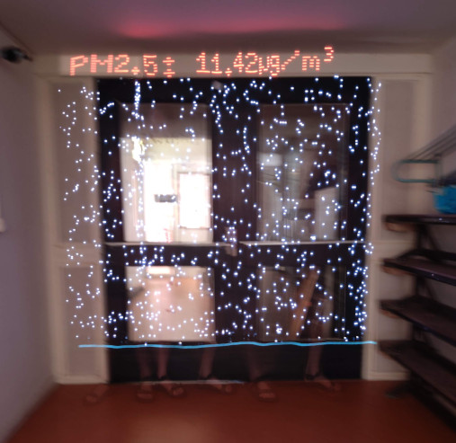
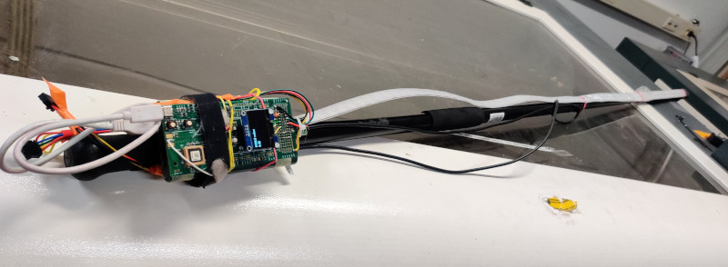
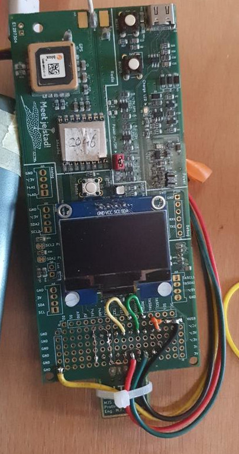
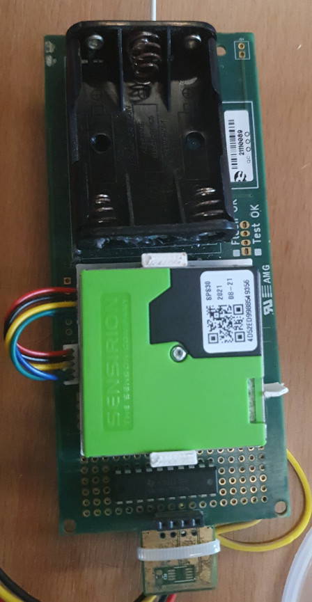

# Pollution Painter (Arduino / Meetjestad build)

## Overview
The Pollution Painter is a digital light painter that allows you to
visualise particulate pollution levels through long exposure
photography. LEDs responding to the pollution levels draw particles of
light to represent particles of pollution. The effect is as if the air
has been put under a microscope and lit up allowing the invisible
particulates to be seen.

This project based on a concept by Robin Price, who published a similar
project based on a raspberry pi zero and Arduino Pro Mini at
https://github.com/robin-price/pollution-painter

His pi zero-based build is quite complex with a lot of different parts
and connections. During [Koppelting](https://www.koppelting.nl), the
idea came up to make a simpler build with a single microcontroller. We
had a number of [MJS2020
boards](https://github.com/meetjestad/mjs_pcb/releases/tag/MJS2020-PROTO4)
(from the [Meetjestad](https://www.meetjestad.net) project) lying
around, which can be programmed using the Arduino development
environment and has a connector prepared for the SPS030 particulate
matter sensor, so we decided to use that (leaving the GPS and LoRa radio
on the board unused).

However, the code is very generic and should work with pretty much any
Arduino-supported board, provided that it can interface with the needed
hardware.

One extra new feature compared to Robin's version is that the current PM
value is displayed in a "field-of-vision" style header line above the
image

## Hardware connections (generic)
This sketch can be run on any Arduino-supported board, provided the
following connections can be made:

 1. The SPS030 should be connected to a 5V-tolerant I²C bus (might also
    need 5V pullups on the controller board if the SPS030 does not have
    them already). The connector on the sensor is tiny so you might need
    some breakout cable to get the wires in a more managable connector
    size.

 2. The Adafruit Dotstar LED (APA102) strip data and clock pins can be
    connected to the MOSI and SCK pins of any available SPI bus for
    hardware-assisted output. Alternatively, any two GPIO pins can be
    used with small code changes to the `Adafruit_Dotstar` constructor
    arguments to use it in bit banging mode.

    The output level of these pins should be 5V, since 3.3V is below the
    minimum 3.5V input HIGH level of the AP102 LED.

    In practice, you can also connect them directly to a 3.3V GPIO pins
    and it will usually work just fine (no chance of damage, but the LED
    strip is not guaranteed to work).

    The power pins of the LED strip can be connected to any GND and 5V
    pins capable of providing sufficient current (exact amount depends
    on the number of leds, brightness and PM level).

    Other types of LED strips can also be used, but that probably needs
    switching from the `Adafruit_Dotstar` library to the `FastLED`
    library which supports more LED strip types (but does not seem to
    support the STM32 chip used in the MJS2020 board well, so we did not
    use it now).

 3. An OLED to display the PM value and other settings. With the
    field-of-vision header line this might not actually be needed
    anymore, it can probably be ommited without making changes to the
    code. Any OLED supported by U8g2 can be used, possibly with some
    changes to the the U8G2 initialization code.

 4. A single button should be connected between any GPIO pin and GND,
    ideally with a small (RC) low-pass filter for debouncing. This can
    be connected to any pin that is supported by `attachInterrupt`.

### Hardware connections (MJS2020)
On the MJS2020 board, we made the following connections:

 1. The SPS030 can be connected to the dedicated connector, which is 5V
    tolerant and has 5V pullups installed.

    One caveat is that this I²C port is not the default one, requiring
    modifications to the arduino-sps library used (see below).

 2. The LED strip was connected to pins on the "experimental print area"
    of the MJS2020 board: GND -> GND, VCC -> VUSB, CI -> SCK1 and DI ->
    MOSI1. For the CI and DI pins we inserted a SN74HCT244N (quad-level
    buffer) as a level shifter, but any other level shifter should do
    (and as noted above, it will often also work without the shifter).

    On the MJS2020 board, the VUSB pin is connected directly (without
    any intermediate components or current limiting) to the USB
    connector, so all available USB current should be available on this
    pin as well.

 3. The OLED (0.96" 128x64) was connected to a dedicated I²C connector
    (which was intended for such a connection - but make sure the pin
    order is correct).

 4. The "user button" in the middle of the board was used as the
    start-stop button. It already has a small RC debounce filter in
    place.

## Software dependencies
The firmware (sketch) is compiled with the Arduino environment. In
addition to adding support for the board you are using (if not supported
by default), you need three libraries:

 - https://www.arduino.cc/reference/en/libraries/sensirion-sps/ For the
   SPS030 PM sensor.
 - https://www.arduino.cc/reference/en/libraries/u8g2/ For the OLED
   display and field-of-view text in the captured image.
 - https://www.arduino.cc/reference/en/libraries/adafruit-dotstar/ For
   the LED strip.

When using the MJS2020 board, a modified version of the sensirion-sps
library must be used because the SPS030 is connected to the second I²C
bus instead of the first. This means to either use [this fork of the
library](https://github.com/meetjestad/arduino-sps) or manually change
all occurances of `Wire` to `Wire1` in the `sensirion_hw_i2c_implementation.cpp`
file.

To add support for the MJS2020 board to the Arduino environment, see
instructions here: <https://github.com/meetjestad/mjs_boards/tree/stm32l0>

Alternatively, you can download a bundle zip according to instructions
at <https://github.com/meetjestad/mjs_firmware#basic-usage> to get the
MJS2020 support and the modified sensirion-sps library (and a few other
libraries that you do not need).

## Notable differences to the original pollution-painter
 - Removed time interpolation, since that seemed to effectively just get
   the last value or a value interpolated between two recent
   measurements, but not really add anything.
 - Changed from `FastLED` to `Adafruit_Dotstar` library since `FastLED`
   does not seem to reliably support STM32.
 - Increased wait (single frame) time from 10ms to 30ms, since the code
   with bit banging seemed to manage that framerate.
 - Added field-of-view text rendering to the top of the image.

## License
pollution-painter-arduino was written by Matthijs Kooijman, taking
inspiration and maybe a handfull of lines of code from Robin Price's
version. Its sources, as well as the accompanying documentation and
other files in this repository are available under the MIT license. See
the LICENSE file for the full
license text.

The `u8x8_d_bitmap.c` file is taken from the U8G2 library and is
licensed under the 2-clause BSD license, see the file for details.
